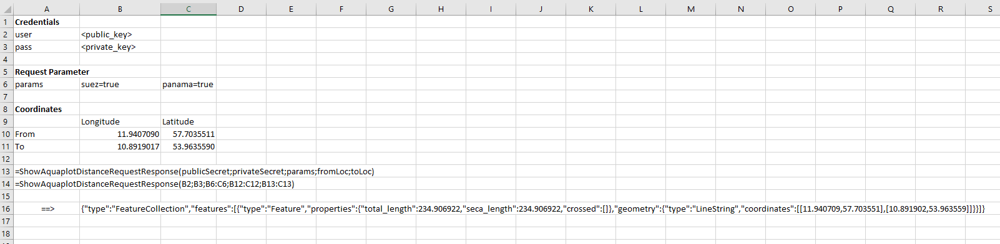

# api-demo-vba
Simple Demo for using [Aquaplot](https://www.aquaplot.com) API with VBA.  
Have a look [here](http://doc.aquaplot.com) to see the full documentation. 

## What is this
You can use the source code from this repository to get a simple prototype up and running quickly and to understand how to interact with the API. This is not a fully featured wrapper, simply a quick demo.

## How to get started
You have a few options: 

1. Download the [excel file](./aquaplot-api-demo.xlsm). Here is a screenshot:  
  
2. You can import the [.bas file](./AquaplotAPIDemo.bas) into your excel file if you already have one.  
3. In case you don't want to download makro files, check out the [text file](./AquaplotAPIDemo.txt) and simply copy-paste its content into your excel file. 

## License
You can do pretty much anything. Check out the [license file](./LICENSE).
